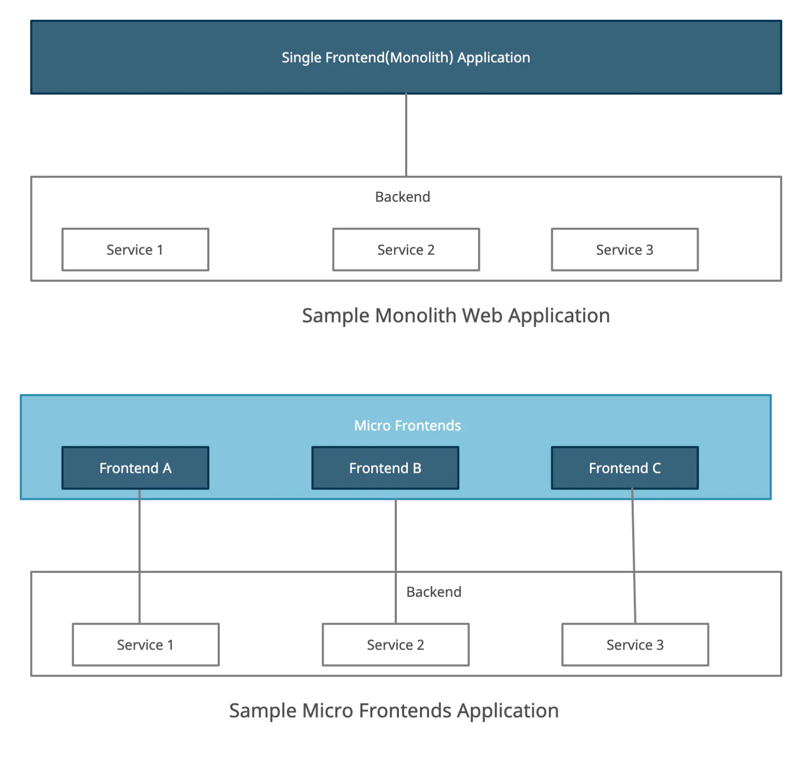
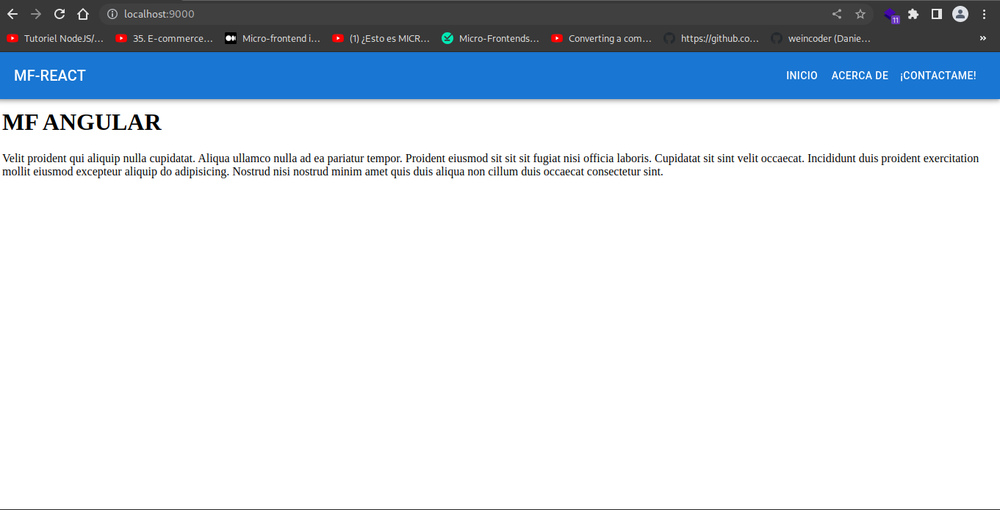
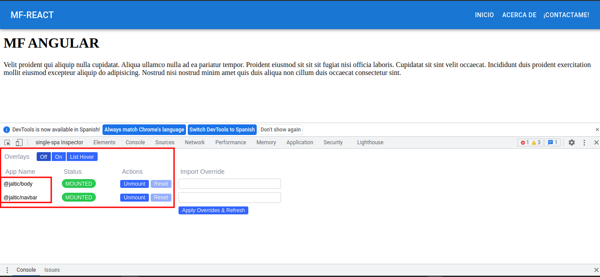
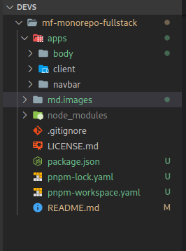
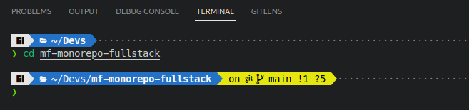
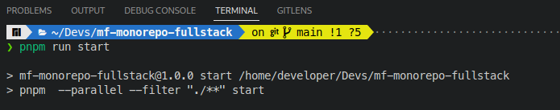

# ***Microfontend Monorepo Fullstack***

## ***¿ Qué es un repositorio ?***

Un repo (abreviatura de repositorio) es un almacén para todos los cambios y archivos de un proyecto, lo que permite a los desarrolladores «controlar la versión» de los activos del proyecto a lo largo de su etapa de desarrollo.

Normalmente nos referimos a los repositorios Git (como los que proporcionan GitHub, GitLab o Bitbucket), pero el concepto también se aplica a otros sistemas de control de versiones (como Mercurial).

## ***¿ Qué es un monorepo ?***

El enfoque monorepo utiliza un único repositorio para alojar todo el código de las múltiples bibliotecas o servicios que componen los proyectos de una empresa. En su versión más extrema, todo el código base de una empresa – que abarca varios proyectos y está codificado en diferentes lenguajes – se aloja en un único repositorio.


## ***¿ Qué es un microfrontend ?***

Actualmente, para separar los diferentes componentes de una aplicación se utilizan los microservicios, funcionando perfectamente en la parte del backend.

Los microservicios son un modo de arquitectura utilizado para construir una aplicación distribuida, estructurando ésta como una colección de servicios. Es decir, los microservicios dividen el backend en diferentes servicios.

Así, cada función de la aplicación se maneja como un servicio independiente, evitando cuellos de botella en la base de datos.

***Los microfrontends*** tienen un concepto similar a los microservicios, es decir, son la extensión del concepto de microservicio al mundo del frontend.

El microfrontend es un tipo de arquitectura donde se divide una aplicación web en diferentes módulos o funciones individuales, implementados de manera autónoma, permitiendo a los equipos de frontend el mismo nivel de flexibilidad y velocidad que los microservicios brindan a los equipos de backend.

Su finalidad es eliminar la dependencia entre los equipos de trabajo, que ralentiza el desarrollo e incrementa la complejidad del producto digital.



## ***Ejemplo Microfrontend***



## ***Consultando tecnologias utilizadas***

* [Extensión Wappalyzer (Google Chrome)](https://chrome.google.com/webstore/detail/wappalyzer-technology-pro/gppongmhjkpfnbhagpmjfkannfbllamg)


* [Extensión single-spa-inspector (Google Chrome)](https://chrome.google.com/webstore/detail/single-spa-inspector/ajhifddimkapgcifgcodmmfdlknahffk)

Muestra los dos microfrontends que se encuentran cargados en la página web.



## *** Estructura del proyecto ***



## Gestor de Paquetes
pnpm

[https://pnpm.io/](https://pnpm.io/)

## Host o Container

📂 client/

## Microfrontend React
📂 navbar/

## Microfrontend Angular
📂 body/

## Despues de clonar el repositorio debes ejecutarlos siguientes comandos.

## 1. Ingresar a la raiz del monorepositorio

* ``` cd mf-monorepo-fullstack ```

)

## 2. Instalar las dependencias de los microfrontends y del servidor de desarrollo.
* ``` pnpm install ```

Este comando instalará todas las dependencias de los microfrontends  y el servidor de desarrollo alojados en los diferentes workspaces del monorepo.


## 3. Una vez instaladas las dependencias, ejecutar el siguiente comando para iniciar los servidores de desarrollo de los microfrontends.

* ``` pnpm run start ```

Este comando ejecutará el script start de cada uno de los microfrontends y el servidor de desarrollo de los mismos de manera simultanea o paralela, en lugar de ingresar a cada uno de los workspace y ejecutar el script start de cada uno de ellos.



## 4. Abrir la siguiente dirección en el navegador.

```http://localhost:9000``` 


